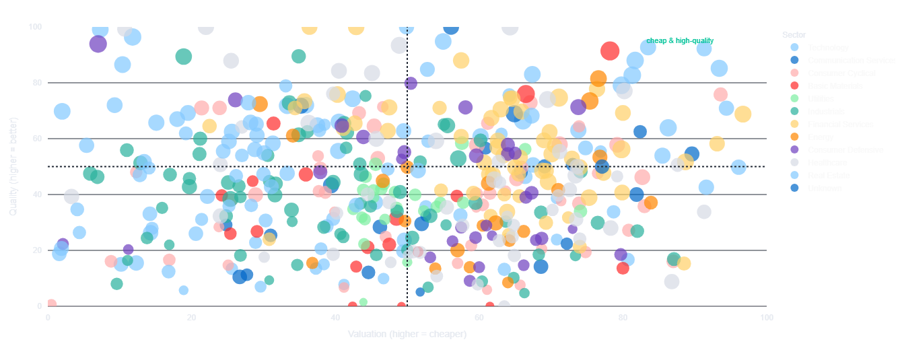
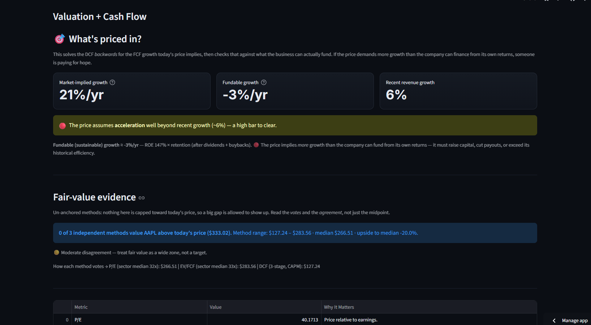
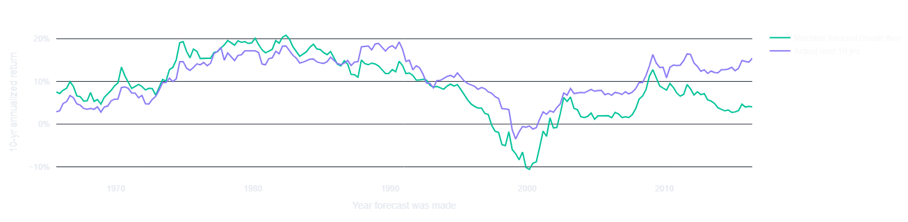
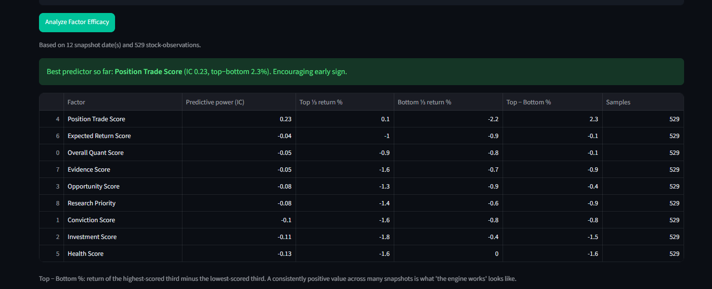

# 📈 Mastermind Quant Terminal

**An honest equity-research terminal — with the portfolio discipline to act on it sanely.**

It scores the entire S&P 500 on institutional-grade fundamentals, values companies the way the textbooks say to (and refuses to pretend the answer is more precise than it is), and — the part I care most about — **measures whether its own signals actually predict returns**, in public, with methodology that can't flatter itself.

🔗 **Live app:** https://quant-terminal-museq45xbpxspebjedgotf.streamlit.app/
💻 **Built with:** Python · Streamlit · pandas · Plotly · Financial Modeling Prep (SEC data) · Yahoo Finance · FRED · GitHub Actions

> ⚠️ **Not financial advice.** This is a research tool that surfaces ideas to study further. It does not tell anyone what to buy or sell.

---

## Why I built it

I wanted to learn how professional equity research actually works — factor investing, valuation, and the discipline of testing whether a strategy has any real edge — by building the thing end to end rather than reading about it. The guiding principle throughout is **intellectual honesty**: it would have been easy to make a backtest that looks impressive; the hard (and useful) part is building tools that tell you the truth, including when the model *doesn't* work.

That principle shaped the architecture in visible ways: missing data is skipped, never faked; backtests are point-in-time, never lookahead; fair value is a set of votes with a confidence grade, never a false-precision target; and a Factor Efficacy page grades the engine's own predictive power against realized returns — and is allowed to say "no edge detected."

---

## What it does (19 pages, one workflow)

### Find ideas
- **Quant Opportunity Engine** — scans the **full S&P 500** across 8 factors (quality, valuation, growth, cash flow, financial strength, momentum, relative strength, risk) rolled into composite Investment / Opportunity / Conviction scores, with an **Opportunity Map** (valuation-vs-quality scatter) and **sector-relative** rankings (a bank vs. banks, not vs. software).
- **Research Queue** + **Daily Briefing** — a prioritized list and a landing page with market mood, watchlist alerts, and fresh opportunities.

### Analyze
- **Stock Deep Dive** — business dossier, moat trajectory, management report card, factor radar, 5-year fundamental trends, forward analyst view, momentum/catalysts, bull-vs-bear, and a one-page PDF export.
- **Valuation, expectations-first.** The headline question isn't "what is it worth?" but **"what growth does today's price already assume, and can the business fund it?"** A reverse DCF solves for the market-implied growth rate; a sustainable-growth check (retention × ROE, using **total shareholder payout including buybacks**) tests whether that growth is even financeable. Fair value is presented as **evidence, not gospel**: independent methods (sector-median P/E and EV/FCF, 3-stage DCF at CAPM — or FCFF at WACC for levered names, justified P/B for financials, DDM for real dividend payers) each cast a **vote** ("3 of 4 methods value it below today's price"), with a **confidence grade** from how tightly they agree. **Nothing is capped toward the current price** — if a stock is priced at 3x what the methods support, the terminal is allowed to say so. Plus scenario DCF (bull/base/bear), Monte Carlo (3,000-run fair-value distribution), valuation vs. the stock's own 5-year history, and cyclically-normalized earnings.
- **Valuation Lab** — an interactive DCF with growth/discount/terminal sliders and a sensitivity table, to build intuition for how assumptions drive value.
- **Compare Stocks**, **ETF Explorer**, **Research Journal**.

### Market context
- **Market Command Center** — a two-horizon market forecast that shows its work: long-run expected returns triangulated from **CAPE regression (1871–today), investor equity allocation (AIAE via Fed Z.1), building-blocks, and the Buffett indicator**, accuracy-weighted into a consensus with an honest walk-forward track record; plus a near-term recession dashboard (yield curve, credit spreads, Sahm rule) — explicitly framed as expectation-setting, not market timing.

### Portfolio discipline
- **Portfolio Manager** — holdings analysis with real risk analytics: beta, concentration, correlation heatmap, a composite diversification score, Sharpe/Sortino/real-return scorecard, and stress-test scenarios.
- **Building Blocks**, **Rebalance**, **Position Sizer** — multi-asset allocation education, target-allocation drift with tax-aware nudges, and conviction/volatility-based sizing.
- **Paper Trading** — a decision log that tracks simulated calls against SPY and tests whether conviction actually predicts outcomes.

### Prove it works (or doesn't)
- **Backtesting Lab** — a methodologically **honest point-in-time backtest** (ranks by the scores you had on a past date, measures the returns that followed — no lookahead), beside a clearly-labeled illustrative one.
- **Factor Efficacy** — from accumulated scan history, each factor's **Information Coefficient** (rank correlation of score vs. realized forward return) and top-vs-bottom spread. This is the honest answer to "does the engine work?" — and it is allowed to say "not yet / not this factor."

---

## 📸 Screenshots

Best experienced live: **https://quant-terminal-museq45xbpxspebjedgotf.streamlit.app/**

Worth a look: the **Opportunity Map**, a **Deep Dive** valuation tab (the "What's priced in?" expectations check), the **Market Forecast**, and the **Factor Efficacy** table.

<!-- To embed images: create a docs/ folder, drop in PNGs, and uncomment:
| | |
|---|---|
|  |  |
|  |  |
-->

---

## 🧠 Methodology highlights

- **Un-anchored valuation.** Earlier versions capped every fair-value method to a band around the current price — which guaranteed reasonable-looking answers and made extreme mispricing structurally invisible. v2 removed the caps, the price-history pseudo-methods, and the hardcoded "fair" multiples (replaced with **sector medians from the live scan**, falling back to a rate-anchored perpetuity multiple that moves with Treasury yields). Methods vote; disagreement is disclosed, not averaged away.
- **Growth must be funded.** DCF growth is anchored to sustainable growth = retention × ROE, where retention uses **total shareholder payout (dividends + net buybacks)** — a buyback giant returning 100% of earnings can't also be assumed to reinvest them. This one change moves fair value materially for most mega-caps.
- **Data integrity first.** Fundamentals from Financial Modeling Prep (SEC-sourced); missing data is **skipped, never given a fake neutral score**; every result carries a data-coverage %. A weekly automated audit re-checks displayed numbers against source-of-truth. When market-data sources fail, the app **says so on the page and retries** — a transient outage is never silently served from cache for a day.
- **Like-for-like comparison.** Sector-relative percentiles avoid comparing a bank's valuation to a software company's.
- **No lookahead bias.** Point-in-time backtests; the factor-efficacy tool quantifies whether any of it has predictive power; the market-forecast backtest trains only on windows that had fully matured at each forecast date.

---

## 🏗️ Architecture & engineering

- **`valuation.py`** — the valuation engine as a pure, dependency-light module (CAPM, 2/3-stage DCF, FCFF/WACC, justified P/B, DDM, reverse DCF, Monte Carlo, the un-anchored blend). No Streamlit, no network, fully deterministic.
- **`test_valuation.py`** — a **30-test unit suite** over the valuation math: hand-computed DCF values, clamp behavior, votes/confidence semantics, method-to-business-type matching, Monte Carlo determinism. Runs with plain Python (pytest-compatible). Every valuation bug found by audits before this suite existed would have been caught by it.
- **`dashboard.py`** — the Streamlit app (pages, scoring engine, charts).
- **`run_scan.py` + GitHub Actions** — a scheduled job scans a rotating slice of the S&P 500 **every weekday** (full index refresh ~every two weeks within free-API limits) and commits results back, which auto-redeploys the live app; a weekend job runs the accuracy audit; a daily job precomputes the market forecast (and **refuses to overwrite a healthy cache with a degraded one** when a data source is down). *The app maintains, re-verifies, and re-values itself, unattended.*
- **Pluggable data layer** — FMP when a key is present, graceful per-ticker fallback to Yahoo Finance, plus an on-disk response cache so re-scans are quota-free.

---

## ▶️ Run it locally

```bash
python -m venv .venv
.venv/Scripts/python.exe -m pip install -r requirements.txt   # Windows
.venv/Scripts/streamlit.exe run dashboard.py
```
Then open http://localhost:8501. Run the test suite with `.venv/Scripts/python.exe test_valuation.py`.

**Optional API keys** (copy `.env.example` → `.env`):
- `FMP_API_KEY` — Financial Modeling Prep, for SEC-sourced fundamentals (free tier works; the app falls back to Yahoo without it).
- `OPENAI_API_KEY` — enables the AI research-memo tab (fully optional).

---

## ⚠️ Disclaimer

This is an educational research tool, not investment advice. It relies on free/best-effort data that can be delayed or wrong, and — as its own Factor Efficacy tab will tell you — no scoring model reliably predicts future returns. Do your own research.
